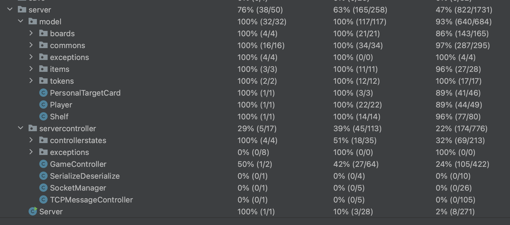
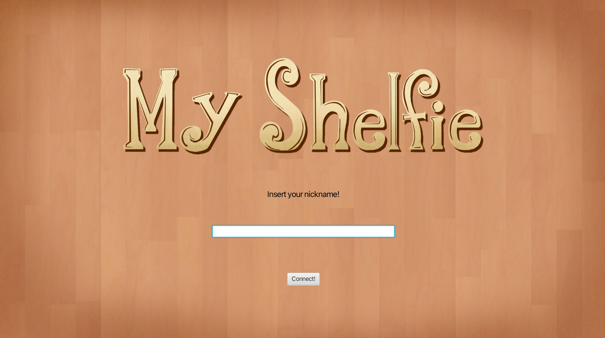
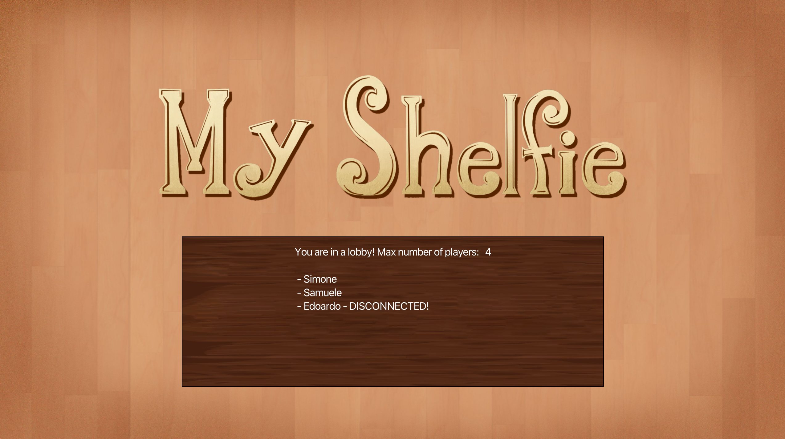
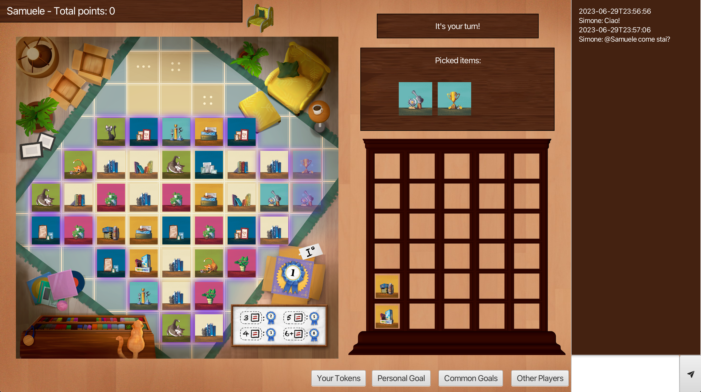
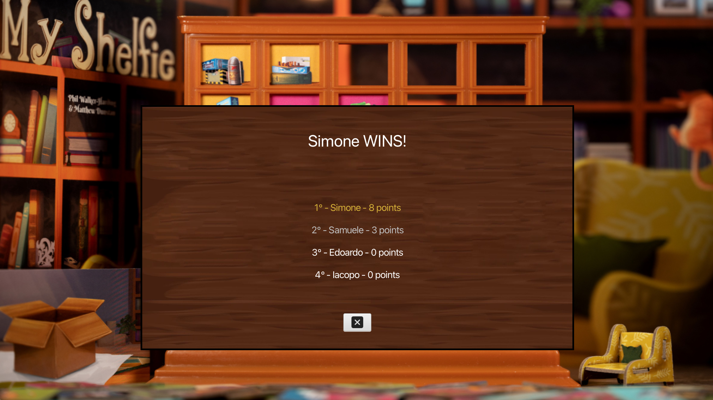

# Software Engeneering - Final Project 2023

Professor: Alessandro Margara<br />
Group name: **IS23-AM41**<br />
Students:

* [D'Alessio Edoardo - edoardo.dalessio@mail.polimi.it](https://github.com/EdoardoDAlessio)
* [De Ciechi Samuele - samuele.deciechi@mail.polimi.it](https://github.com/Samdec01)
* [Deidier Simone - simone.deidier@mail.polimi.it](https://github.com/SimoneDeidier)
* [Ermacora Iacopo - iacopo.ermacora@mail.polimi.it](https://github.com/IacopoErmacoraPolimi)

## Objectives

- [x] Simple rules
- [x] Full rules
- [x] Text User Interface
- [x] Graphic User Interface
- [x] RMI connection
- [x] Socket connection
- [ ] Multiple matches
- [x] Persistence
- [x] Disconnection resilience
- [x] Chat

### Works status

|Feature name|Status|Percentage status|Comments|
|:-:|:-:|:-:|:-:|
|Simple rules|Done|100%||
|Full rules|Done|100%||
|TUI|Done|100%||
|GUI|Done|100%||
|RMI|Done|100%||
|TCP|Done|100%||
|Multiple matches|Not implemented|0%|We chose to not implement this advanced feature|
|Server persistance|Done|100%||
|Disconnection resilience|Done|100%||
|Chat|Done|100%||

## Unified Modeling Language

The first step for this course is to design the *UML* of the game with the mandatory implementation of the *Model-View-Controller design pattern*. All the UML's are published and available to inspect, they can be found in the ***deliveries/UML*** folder. 

## *Peer-reviews*

During this course, we will have to review some documents of other's groups. Our group will also be reviewed, and to help other students understanding our works and our ideas, we will create some *"description documents"*. All the documents (*peer-reviews and description*) are published, in fact:

* All the *peer-review documents* are available to read in the ***deliveries/peer-reviews/reviews*** folder.
* All the *description documents* are available to read in the ***deliveries/peer-reviews/documents*** folder.

## Code testing

All the code from the *Model classes* and the most important from the *Server-Controller classes* has been tested with ***JUnit***, a powerful suite for the code testing and validation. Our test coverage:

* Number of tests: **40.110** - *all passed*

|*MVC* Classes|Class coverage|Method coverage|Lines of code coverage|
|:-:|:-:|:-:|:-:|
|Model|100%|100%|93%|
|Server-Controller|29%|39%|22%|



## How to launch the app

The command to be executed to start the server and/or client is a single one:

```console
java -jar MyShelfie-SERVER-AM41.jar
```

if you want to ***start the server***, oterwise:

```console
java -jar MyShelfie-CLIENT-AM41.jar
```

> Warning! In the case of **Aarch64 architecture** start *MyShelfie-CLIENT-Aarch64.jar*, in the case of **x86/x64 architecture** start *MyShelfie-CLIENT-x86.jar* (*unfortunately, the JavaFX libraries in the JARs are not architecture-independent*)!

if you want to ***run the client***.

Both the server and the client *require certain connection and user interface parameters to be entered at start-up*, which can be provided directly from the command line as parameters to the commands listed above. Below is a **table of commands** with descriptions:

### Server commands

|Command|Short command|Description|Example|
|:-:|:-:|:-:|:-:|
|```--rmi```|```-r```|Specifies the port on which to open the RMI connection.|```--rmi 1234```|
|```--tcp```|```-t```|Specifies the port on which to open the TCP connection.|```--tcp 8888```|
|```--ipaddr```||Specifies the IP address of the host on which the server runs. This can be either an IPv4 address or the 'localhost' keyword.|```--ipaddr 192.168.1.12```|

### Client commands

|Command|Short command|Description|Example|
|:-:|:-:|:-:|:-:|
|```--conn```|```-c```|Specifies the type of connection with which the server will be reached. This may be 'rmi' or 'tcp'.|```--conn tcp```|
|```--ui```|```-u```|Specifies the type of user interface to be launched. It can be 'tui' for the Text User Interface or 'gui' for the Graphical User Interface.|```--ui gui```|
|```--ipaddr```||Specifies the IP address of the server to connect to. This can be either an IPv4 address or the 'localhost' keyword.|```--ipaddr localhost```|
|```--port```|```-p```|Specifies the server port to connect to.|```--port 8888```|

### Full example

```console
java -jar MyShelfie-SERVER-AM41.jar -r 1234 -t 8888 --ipaddr localhost
```

* *This command starts the server in localhost, with the TCP connection open on port 8888 and the RMI connection on port 1234.*

```console
java -jar MyShelfie-CLIENT-AM41.jar -c tcp -u gui --ipaddr 192.168.1.12 -p 8888
```

* *This command starts the client with Graphical User Interface, which will try to establish a connection to the server with IP address 192.168.1.12 via a TCP connection on port 8888.*

> *Please, note that all values to commands are case insensitive (e.g. the software detects both command ```--ipaddr LOCALHOST``` and ```--ipaddr localhost``` without problems), while all commands are only accepted in lower case (command ```--PORT``` is not recognised, while ```--port``` is).*

## *In-game* GUI screenshots



> *In-game screen of the first scene.*



> *In-game screen of the lobby.*



> *In-game screen of the gaming phase.*



> *In-game screen of the end game scene.*

## Slideshow

A short slideshow summarising the key points of this project is available [here](slideshow/Slideshow-IS23-AM41.pdf).

## Final evaluation

Final project grade proposed by the professor was: ***30L/30***.
